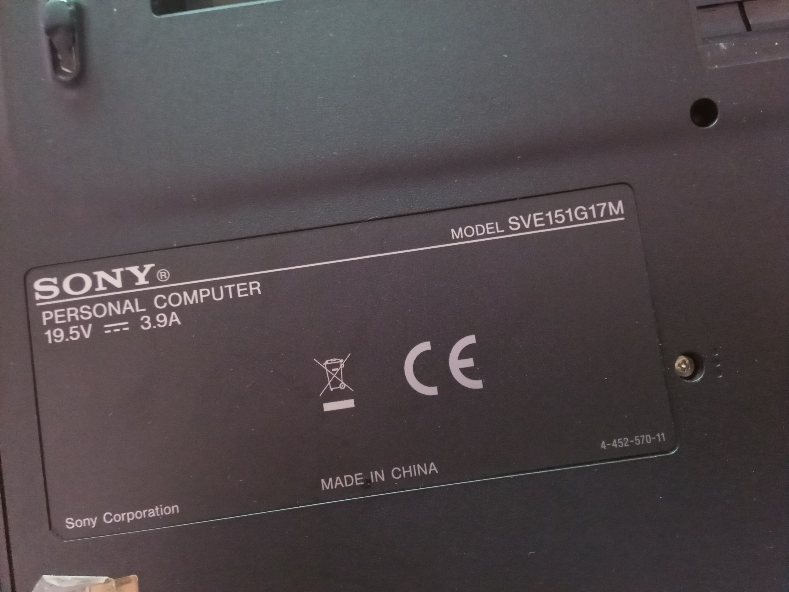

My gear 2022

- Sony Vaio:
    - Merk
        - Product Model: SVE151G17M
        - Product Name: SVE1513F1EB
        - Battery Type: VGP-BPS26
    - Specification
        - Intel(R) Core(TM) i5-3210M CPU @ 2.50GHz
        - DDR3 12 GB

- Software list for working:
    - OS:
        - Bunsenlabs Lithium (personal)
        - MacOS (coorporate)
        - Windows (personal)
    - IDE:
        - VSCode
        - Codium
        - Pycharm
        - dbeaver-ce
    - others:
        - flameshot
        - SSR (simpleScreenRecorder)
        - Vidyard (chrome app)
    - programming-languages:
        - Go (snap, brew)
        - Ruby (rbenv)
        - Python (pyenv)

